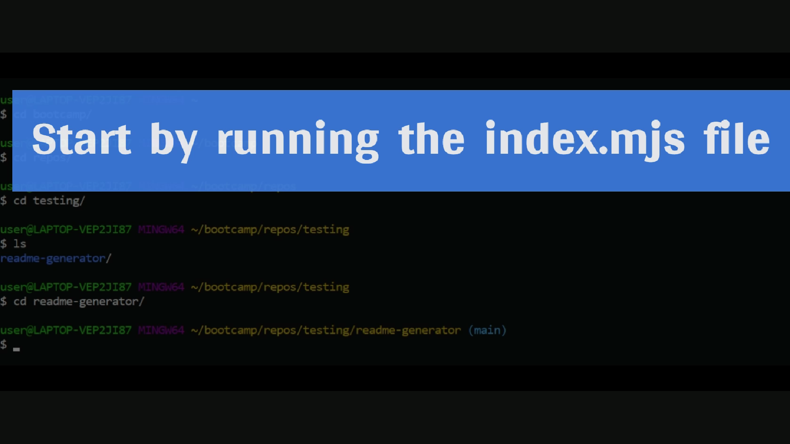

# README Generator

## Description

A tool for developers. This project features a README file generator for project creators. Using a command-line application, developers can easily create a README file by just entering the details about their projects.

## Getting Started

### Prerequisites

- **Node.js** is required to run the application

### Installation

1. **Clone the repository** ([A guide to cloning repo](https://docs.github.com/en/repositories/creating-and-managing-repositories/cloning-a-repository#cloning-a-repository))  
   `https://github.com/cl-lee/readme-generator.git`
2. **Install the Inquirer package**  
   `npm install inquirer`

## Usage

1. To begin using the application, open a command-line application and go into the _readme-generator_ folder cloned from GitHub

2. The following video demonstrates how to run the application

## Contact

Project Link: https://github.com/cl-lee/readme-generator

## Acknowledgements

[Markdown License Badges](https://gist.github.com/lukas-h/2a5d00690736b4c3a7ba)
