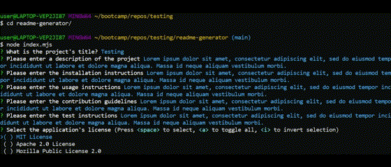

# README Generator  
## Description
A tool for developers. This project features a README file generator for project creators. Using a command-line application, developers can easily create a README file by just entering the details about their projects.

## Getting Started
### Prerequisites
- **Node.js** is required to run the application

### Installation
1. **Clone the repository** ([A guide to cloning repo](https://docs.github.com/en/repositories/creating-and-managing-repositories/cloning-a-repository#cloning-a-repository))  
   Repo link: `https://github.com/cl-lee/readme-generator.git`
2. **Install the Inquirer package**  
    `npm install inquirer`

## Usage
- To begin using the application, open a command-line application and go into the *readme-generator* folder cloned from GitHub

### 1. Run the node.mjs file
Enter command: `node index.mjs`  
  

### 2. Enter the project information

### 3. Select the license used

### 4. Enter contact information (for display in the Questions section)

### 5. Output
The output can be found in the "output" folder inside the cloned "readme-generator" folder

## Contact
Project Link: https://github.com/cl-lee/readme-generator

## Acknowledgements
[Markdown License Badges](https://gist.github.com/lukas-h/2a5d00690736b4c3a7ba)